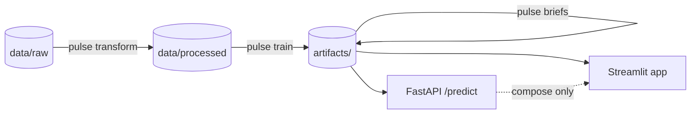

# Neighbourhood Pulse

**Finding London neighbourhoods that may be about to rise in value.** The
project reads three early signs of change for every small area of London
(planning applications, buildings converted to new uses, and independent
cafés), models what homes there should cost, and flags areas selling well
below that estimate.

[](https://neighbourhood-pulse.streamlit.app)
[](https://github.com/AniketYadav17/Neighbourhood-Pulse/actions/workflows/ci.yml)


**Live app:** https://neighbourhood-pulse.streamlit.app


## What it does

1. Collects about 350,000 planning applications (all 33 London boroughs) and
   about 6,600 café locations.
2. Turns them into per-area signals on a hexagon grid, correcting for how
   slowly each borough reports its data.
3. Trains an XGBoost model to estimate each area's typical sale price from
   those signals. The model explains about 44% of price variation on data it
   never trained on (R² ≈ 0.44). The **valuation gap** is the actual price
   versus that estimate, always scored by a model that never saw the area.
4. Checks the idea against history: areas the model called underpriced in
   2021–22 grew more by 2024–25, consistently across the range (+7.3% for the
   most underpriced fifth vs −1.5% for the most overpriced).
5. Serves it all as an interactive map with short AI-written briefs and a
   live "what if this area changed?" repricing tool.

## Architecture



A batch pipeline writes four committed artifacts; two thin consumers (the app
and an API) read them. Details: [docs/ARCHITECTURE.md](docs/ARCHITECTURE.md) ·
design rationale: [docs/DECISIONS.md](docs/DECISIONS.md).

## Quickstart

```bash
git clone https://github.com/AniketYadav17/Neighbourhood-Pulse.git
cd Neighbourhood-Pulse
pip install -e ".[dev]"        # add [geo] only if you'll run ingestion locally

# The app runs immediately from the committed artifacts:
streamlit run app/app.py

# Or rebuild everything from raw data (hours; network; ~1 GB Land Registry CSVs):
pulse ingest && pulse transform && pulse train
```

`pytest` (no network needed) and `ruff check .` run in CI on every push. CI
also pins the pipeline's output to the validated research results and builds
the serving Docker image.

## API

`docker compose up --build` starts the FastAPI service on port 8000
(interactive docs at http://localhost:8000/docs) alongside the app on 8501.

```bash
curl "localhost:8000/hexagons?borough=Hackney&max_gap=-0.2"   # undervalued Hackney hexagons
curl "localhost:8000/hexagons/<h3_index>"                     # signals + prices + AI brief
curl -X POST localhost:8000/predict -H "content-type: application/json" \
     -d '{"total_applications": 120, "change_of_use_count": 12, "applications_recent": 30,
          "change_of_use_ratio": 0.1, "planning_velocity": 1.2, "total_cafe_count": 4,
          "independent_cafe_count": 3, "cafe_to_application_ratio": 0.033, "dist_to_centre_km": 9.5}'
```

## Results

| Metric | Value |
|---|---|
| R² on unseen areas (XGBoost, log price) | 0.439 |
| R² linear baseline | 0.418 |
| Modelled areas (≥30 pooled sales) | 1,694 |
| Back-test gap→growth correlation | −0.249 |
| Growth spread, most- vs least-underpriced fifth | +7.3% vs −1.5% |

The strongest predictor, after accounting for how central an area is, is the
share of planning applications that change a building's use: the "shops
becoming cafés or flats" signal.

## What this can and cannot tell you

- **It is a research signal, not investment advice.** A large gap says "the
  model expected this area to cost more". That can mean opportunity, or it
  can mean the model is missing something about that area.
- **Location is only partly accounted for.** The model uses one
  distance-from-centre measure, but London has many centres. Some outer areas
  look underpriced partly because of where they are.
- **The back-test is indicative, not proof.** The signals were not strictly
  frozen at 2021, and two-year windows of sales are thin at this map scale.
- **Coverage is about two thirds of London.** An area needs planning activity
  and at least 30 home sales in 2021–2025 to be modelled.

Planned next: scheduled data refreshes with PostGIS, drift monitoring, a
retraining cadence, and better address matching (66% → 95% coverage).

## Data sources

[Planning London Datahub](https://planninglondondatahub.london.gov.uk) ·
[OpenStreetMap via OSMnx](https://github.com/gboeing/osmnx) ·
[HM Land Registry Price Paid](https://landregistry.data.gov.uk/) — see
[CITATIONS.md](CITATIONS.md).
