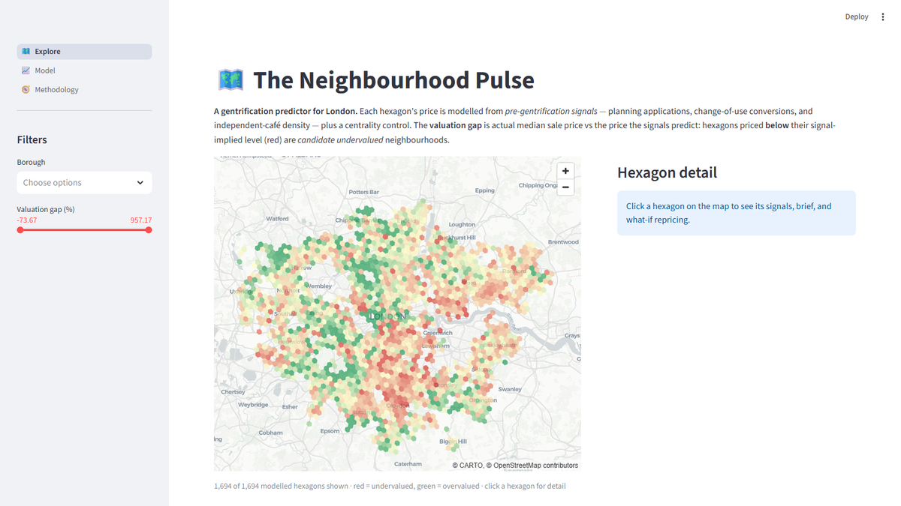
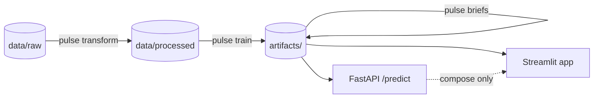

# Neighbourhood Pulse

**A gentrification predictor for London** — planning applications, change-of-use
conversions, and independent-café density, modelled per H3 hexagon against Land
Registry prices to surface *candidate undervalued* neighbourhoods before price
growth appears.

[](https://github.com/AniketYadav17/Neighbourhood-Pulse/actions/workflows/ci.yml)
[](https://neighbourhood-pulse.streamlit.app)


**Live app:** https://neighbourhood-pulse.streamlit.app · **API docs:** `docker compose up` → http://localhost:8000/docs



## What it does

1. Ingests ~350k planning applications (all 33 boroughs) and ~6,600 cafés.
2. Engineers per-hexagon signals with a per-borough reporting-lag correction.
3. Trains XGBoost on `log(median sale price)` (held-out R² ≈ 0.44) and computes
   an **out-of-fold valuation gap** — actual price vs signal-implied price.
4. Back-tests the thesis: hexagons flagged undervalued early (2021–22) grew
   **monotonically more** (+7.3% → −1.5% across gap quintiles into 2024–25).
5. Serves it: an interactive hexagon map with per-neighbourhood LLM briefs and
   a live what-if repricing panel.

## Architecture



Batch pipeline → four committed serving artifacts → two thin consumers.
Details: [docs/ARCHITECTURE.md](docs/ARCHITECTURE.md) · design rationale:
[docs/DECISIONS.md](docs/DECISIONS.md).

## Quickstart

```bash
git clone https://github.com/AniketYadav17/Neighbourhood-Pulse.git
cd Neighbourhood-Pulse
pip install -e ".[dev]"        # add [geo] only if you'll run ingestion locally

# The app runs immediately from the committed artifacts:
streamlit run app/app.py

# Or rebuild everything from raw data (hours; network; ~1 GB Land Registry CSVs):
pulse ingest && pulse transform && pulse train

# API + app together (what-if panel round-trips through POST /predict):
docker compose up --build      # api :8000 (/docs), app :8501
```

`pytest` (92 tests, no network) and `ruff check .` run in CI on every push,
including a parity gate that pins the pipeline's output to the validated
research results and a Docker build of the serving image.

## API

With `docker compose up` running (interactive OpenAPI docs at http://localhost:8000/docs):

```bash
curl "localhost:8000/hexagons?borough=Hackney&max_gap=-0.2"   # undervalued Hackney hexagons
curl "localhost:8000/hexagons/<h3_index>"                     # signals + prices + LLM brief
curl -X POST localhost:8000/predict -H "content-type: application/json" \
     -d '{"total_applications": 120, "change_of_use_count": 12, "applications_recent": 30,
          "change_of_use_ratio": 0.1, "planning_velocity": 1.2, "total_cafe_count": 4,
          "independent_cafe_count": 3, "cafe_to_application_ratio": 0.033, "dist_to_centre_km": 9.5}'
```

## Results

| Metric | Value |
|---|---|
| Held-out R² (XGBoost, log price) | 0.439 |
| Held-out R² (linear baseline) | 0.418 |
| Modelled hexagons (≥30 pooled sales) | 1,694 |
| Back-test gap→growth correlation | −0.249 |
| Growth spread, most- vs least-undervalued quintile | +7.3% vs −1.5% |

Top predictor after controlling for centrality: **change-of-use ratio** — the
"shops becoming cafés/flats" signal.

## Honest limitations

- One distance-to-centre feature can't fully model London's polycentric price
  surface — some outer-borough "undervaluation" is residual location effect.
  The gap is a candidate signal, not investment advice.
- The back-test is proof-of-concept: features aren't strictly frozen as of
  2021, and 2-year sale windows are thin at hexagon level.
- Coverage is ~66% of London hexagons (planning activity + sales floor).
- Future work: PostGIS + scheduled ingestion, drift monitoring, retraining
  cadence, geocoding coverage 66%→95%.

## Data sources

[Planning London Datahub](https://planninglondondatahub.london.gov.uk) ·
[OpenStreetMap via OSMnx](https://github.com/gboeing/osmnx) ·
[HM Land Registry Price Paid](https://landregistry.data.gov.uk/) — see
[CITATIONS.md](CITATIONS.md).
