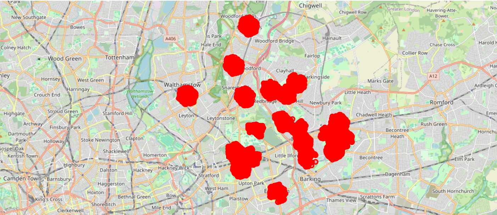

# Neighbourhood-Pulse


### The Neighbourhood Pulse: A Spatiotemporal Gentrification Predictor for London.

## Why this matters?

Gentrification is happening all around London, and the best time to invest in these properties was 6 months ago. 

A major way gentrification is measured by tracking the change in house prices. But, as silly as it sounds, economic indicators suggest the existence of pre-gentrification signals that can help us invest in properties early on. These are usually the areas flocked by young professionals who desire a safer space with low rental prices. An existing trend is the pop-up of independent cafes around these areas, which can act as an early indicator of gentrification. 
Another worthy early signal, before the warehouses turn into flats, shops into restaurants and industrial units into creative studios, are the applications that are filed 12-24 months in advance before the actual change in geography.

Using these data-points and Land Registry data as ground truth, a predictive model is built to quantify these signals and identify undervalued London neighbourhoods before price growth appears. 

This has direct applications in property investment, retail site selection, and mortgage risk assessment. Equally, it provides critical foresight for city planning and transportation, allowing authorities to proactively adapt transit routes, allocate resources, and update public infrastructure ahead of rapid demographic shifts.

## The Data

### 1. Planning London Datahub
[Planning London Datahub](https://planninglondondatahub.london.gov.uk) — Planning data 
about change-of-use in property.
- 46,000+ planning applications across three London boroughs
- Pipeline designed to scale to all 33 boroughs (~2-3 million records)

### 2. OpenStreetMap via OSMnx
[OSMnx](https://github.com/gboeing/osmnx) — Used to extract existing 
cafe locations across Greater London.
- 6,600+ independent coffee shops fetched

### 3. Land Registry Price Paid Data
[Land Registry](https://landregistry.data.gov.uk/) — Public property 
transaction data used as ground truth for price growth. 

## Tech Stack

| Tool | Purpose |
|------|---------|
| Python | Primary language |
| Elasticsearch API | Reverse engineered internal API via Chrome DevTools |
| OSMnx | OpenStreetMap interface for coffee shop data |
| Pandas | Data manipulation and transformation |
| Parquet / PyArrow | Column-based storage, 100x faster than CSV |
| Requests | HTTP client for API calls |

## Project Structure 
```
neighbourhood-pulse/
│
├── app/
│   └── app.py                  ← Streamlit web application
│
├── data/
│   ├── raw/                    ← Raw fetched data (not tracked by Git)
│   └── processed/              ← Processed data + the committed valuation-gap artifact
│
├── notebooks/
│   └── 01_eda.ipynb            ← Frozen research record (EDA → features → model → back-test)
│
├── src/
│   └── neighbourhood_pulse/    ← Installable package
│       ├── config.py           ← All constants and configuration
│       ├── ingestion.py        ← Resumable planning + café data acquisition
│       ├── transformation.py   ← BNG→WGS84 conversion and H3 indexing
│       └── cli.py              ← `pulse` command-line entry point
│
├── tests/                      ← Characterization tests (mocked HTTP, no network)
├── .github/workflows/ci.yml    ← Lint + tests on every push
├── pyproject.toml              ← Package metadata, dependencies, tooling config
└── CITATIONS.md                ← Data source attributions
```

## How to Run 

1. Clone the repository
```bash
git clone https://github.com/AniketYadav17/Neighbourhood-Pulse.git
cd Neighbourhood-Pulse
```

2. Install (Python 3.10+)
```bash
pip install -e .
```

3. Run the data pipeline (fetches ~490k planning records; resumable, takes a while)
```bash
pulse ingest
pulse transform
```

4. Launch the app
```bash
streamlit run app/app.py
```

## Results  

*Top 20 most active H3 hexagons across Newham, Redbridge and Waltham Forest*

## Limitations and Future Work

- Currently, planning data from three boroughs (Newham, Redbridge, Waltham Forest) is extracted. Going forward, all 33 boroughs planning data can be extracted for analysis and prediction. 
- Within Planning data, we can extract details about upcoming cafe shops opening and not just the current ones to get a stronger prediction signal.
- We can scrape the data weekly, use a PostgreSQL Database with PostGIS and automate the ML pipeline to retrain the model and observe data drifts. 

## Citations

Boeing, G. (2025). Modeling and Analyzing Urban Networks and Amenities with OSMnx. Geographical Analysis 57 (4), 567-577. doi:10.1111/gean.70009