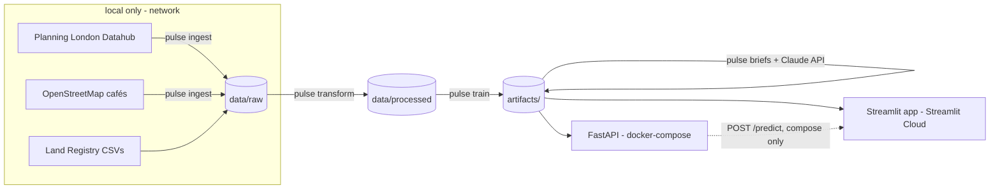

# Architecture

The system is a batch pipeline that produces four small **serving artifacts**,
plus two thin consumers of those artifacts (a Streamlit app and a FastAPI
service). Nothing serves from a database or recomputes at request time.

## Pipeline stages (`pulse <stage>`)

| Stage | In | Out | Properties |
|---|---|---|---|
| `ingest` | Planning API + OSM | `data/raw/` | resumable per borough, retry/backoff, rate-limited |
| `transform` | raw parquet | `data/processed/` | BNG→WGS84, H3 res-8 indexing |
| `train` | processed + LR CSVs | `artifacts/` (gap, metrics, model) | idempotent stages, deterministic (seeded), parity-gated |
| `briefs` | gap artifact | `artifacts/briefs.json` | per-hexagon cache, cost cap, schema-validated |

## The artifact contract

Everything downstream reads exactly four committed files:

| Artifact | Contents | Consumers |
|---|---|---|
| `hex_valuation_gap.parquet` | per-hexagon signals, prices, OOF gap | app Explore, API `/hexagons` |
| `metrics.json` | R², importances, back-test, build provenance | app Model page, CI contract test |
| `model.joblib` | full-data XGBoost fit (serving only) | what-if repricing (app in-process, API `/predict`) |
| `briefs.json` | LLM briefs for the top-50 undervalued hexagons | app detail panel, API detail endpoint |

CI load-tests the committed artifacts on every push (`tests/test_serving_artifacts.py`),
so a broken artifact cannot reach the deployed app.

## Deployment topology

- **Public app:** Streamlit Community Cloud, standalone, reads committed
  artifacts — zero backing services, zero API keys at runtime.
- **API + app:** `docker compose up` — one image, two services with
  healthchecks; the app's what-if panel calls `POST /predict` via
  `PULSE_API_URL`. This is the local/demo/interview prod-parity path; the
  public app never depends on it (a deliberate reliability decision —
  see docs/DECISIONS.md).
- **CI:** ruff + pytest (no network, no large data) + a docker build/smoke job.
